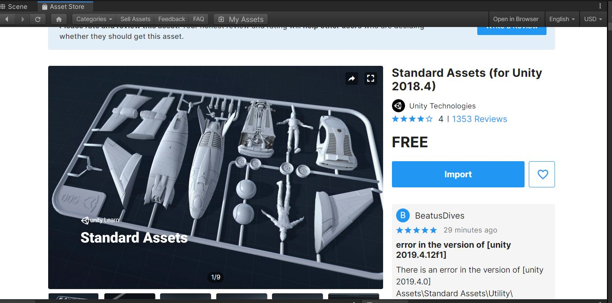
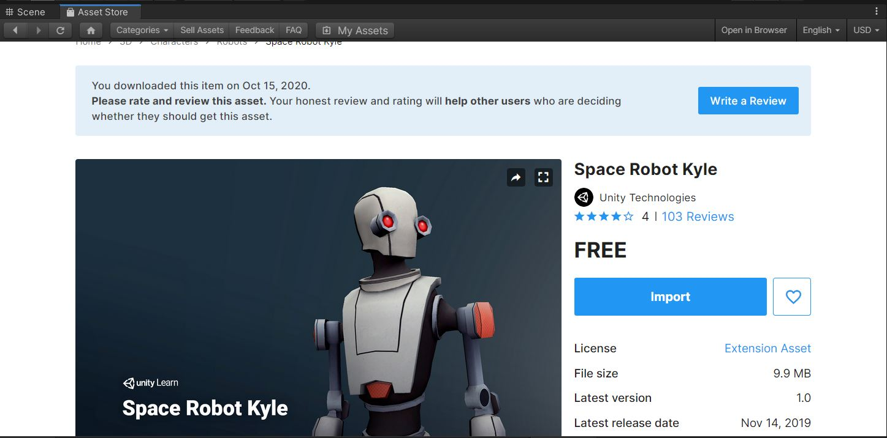
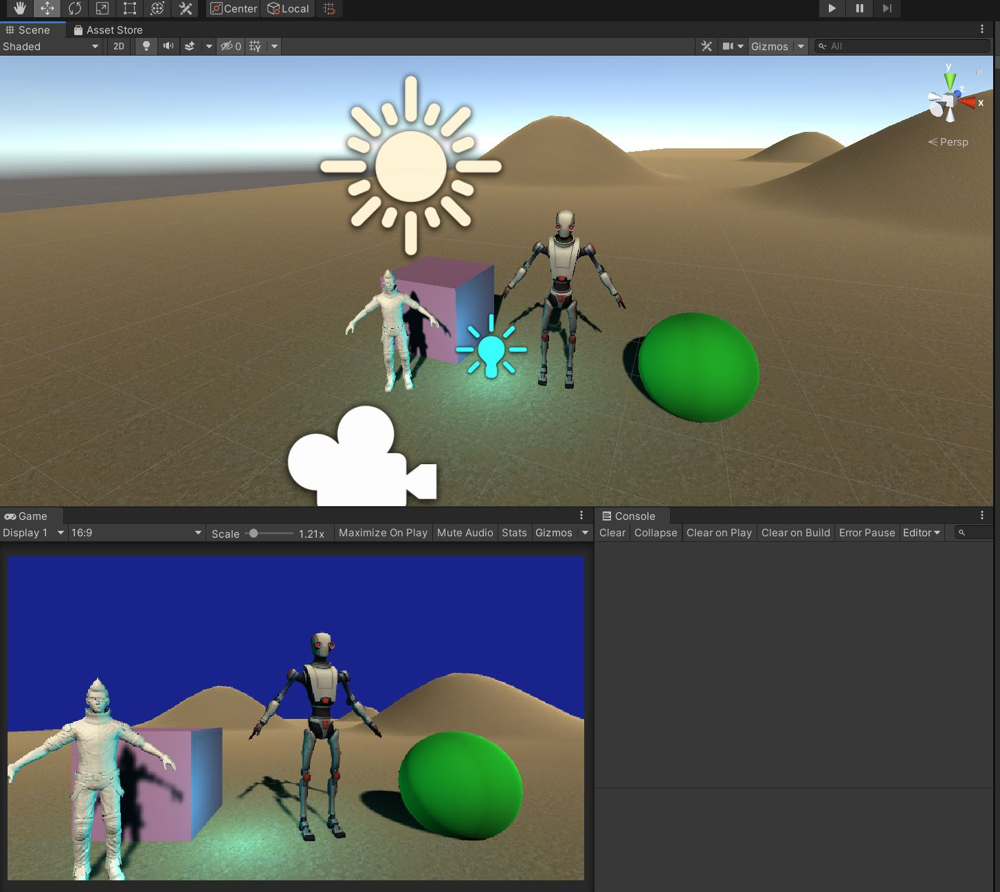
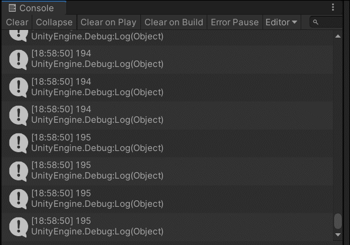

# Interfaces Inteligentes
# Práctica 1: Introduccion-Unity

##### Sergio González Guerra

## 1. Importar las Standard Assets

En la Assets Store de Unity podemos descargar los diferentes recursos para usar en nuestros proyectos,
para esta práctica usaremos los "Standart Assets" y "Space robot kyle".
Despues de descargar los assets, pulsamos el botón de importar.





## 2. Colocación de GameObjects en el escenario.

Dentro de GameObject > 3D Object, podremos elegir diferentes formas 3D prediseñadas como un cubo o una esfera.
Tambien se pueden añadir Terrenos en GameObject > 3D Object > Terrain, o luces en GameObject > Light > Directional light
 y un punto de luz en GameObject > Light > Point light.



Ademas he agregado los modelos descargados del Assets Store como Ethan y el Robot.

## 3. Añadir Scripts a los GameObjects para darles un comportamiento.

Despues de crear una carpeta especifica para los scripts, podemos añadir estos
con click derecho en la carpeta > Create > C# Script.
Por cada GameObject he creado un script en el que muestra un mensaje con el nombre
del objeto, su identificador por consola y un contador que va iterando en cada frame del Update().

```
using System.Collections;
using System.Collections.Generic;
using UnityEngine;

public class pruebaRobot : MonoBehaviour
{

    int cont;
    int id = 0;

    // Start is called before the first frame update
    void Start()
    {
        Debug.Log(gameObject.name);
        Debug.Log("id: " + id);
    }

    // Update is called once per frame
    void Update()
    {
        cont++;
        Debug.Log(cont);
    }
}
```

#### Salida del Script por consola:


